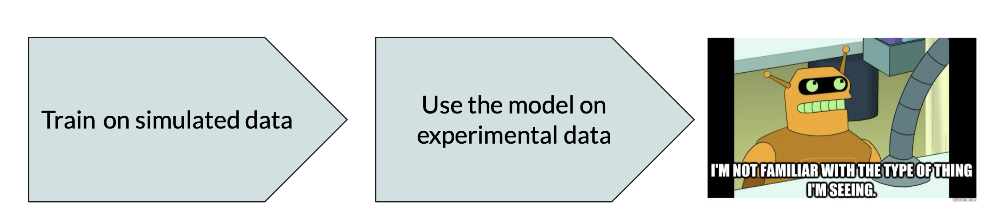

# DeepMergeDomainAdaptation
Deep domain adaptation for astronomy using Maximum Mean Discrepancy (MMD) and adversarial training using Domain Adversarial Neural Networks (DANNs)  - simulated and observer galaxy mergers. We also implement optional use of the Fisher loss and Entropy minimization to enforce within class compactness and between class separability in both domains.


### About
Working with images from two domains is a challanging problem in all domains of computer vision. In astronomy, transferability of deep learning models from simulated to real observed images or from one telescope to another, is a necessity. 
Drop in model classification accuracy between images used to train the model (source domain) and images from some other domain (target domain) can be mitgated to some extent by using domain adaptation techniques. 
Here we implement domain adaptation to improve classification of simulated and real merging galaxies. Studies of merging galaxies are challending due to small number of identified mergers in real data, biases in labeling those objects, as well as differences between observed and simulated objects. Domain adaptation and similar techniques will in the future be needed in order to sucessfully transfering knowledge obtained from these different domains. They will also play a crutial role for sucessfull detection of new merger candidates in very large astronomical surveys that will be available in the near future.

### Architecture
Our experiments were performed using a simple CNN architecture (3 convolutional, 3 pooling adn 3 danse layers) called DeepMerge, as well as using more complex and well known ResNet18 network.

### Prepare Datasets
Images used can be found at Zenodo:..... There are two tipes of experiments we run: Simulation to Simulation; and Simulation to Real.

#### Simulation to Simulation Experiments
Data used to study distant merging galaxies using simulated images from the Illustris-1 cosmological simulation at redshift z=2. The images are 75x75 pixels with three filters applied that mimic Hubble Space Telescope (HST) observations (ACS F814W,NC F356W, WFC3 F160W) with added point-spread function and with or without observational noise.

Source Domain:

     - Images: SimSim_SOURCE_X_Illustris2_pristine.npy
     
     - Labels: SimSim_SOURCE_y_Illustris2_pristine.npy

Target Domain:

    - Images: SimSim_TARGET_X_Illustris2_noisy.npy
    
    - Labels: SimSim_TARGET_y_Illustris2_noisy.npy

#### Simulation to Real Experiments
Data used to study nearby merging galaxies using simulated Illustris-1 images at redshift z=0 and real Sloan Digital Sky Survey (SDSS) images from the Galaxy Zoo project. All images have three filters. SDSS images have (g,r,i) filters, while simulated Illustris images also mimic the same three SDSS filters with added effects of dust, point-spread function, and observational noise.

Source Domain - Illustris-1 images (snapshot z=0) with added effects of dust, PSF and observational noise mimicking SDSS observations

    - Images: SimReal_SOURCE_X_Illustris0.npy
    
    - Labels: SimReal_SOURCE_y_Illustris0.npy

Target Domain - SDSS images of merging galaxies, labeled through Galaxy Zoo project

    - Images: SimReal_TARGET_X_postmergers_SDSS.npy
    
    - Labels: SimReal_TARGET_y_postmergers_SDSS.npy


### Training
Explanation how to run different versions of training as well as evaluation are given in example notebook: 
```
Running_DeepMergeDomainAdaptation_files.ipynb 
```


### Requirements
Code was developed using Pytorch 1.7.0. The requirements.txt file should list all Python libraries that your notebooks will need, and they can be installed using:
```
pip install -r requirements.txt
```


### Authors
- Aleksandra Ćiprijanović
- Diana Kafkes
- Gabriel Perdue

### References
If you use this code, please cite our paper: arXiv:..........
